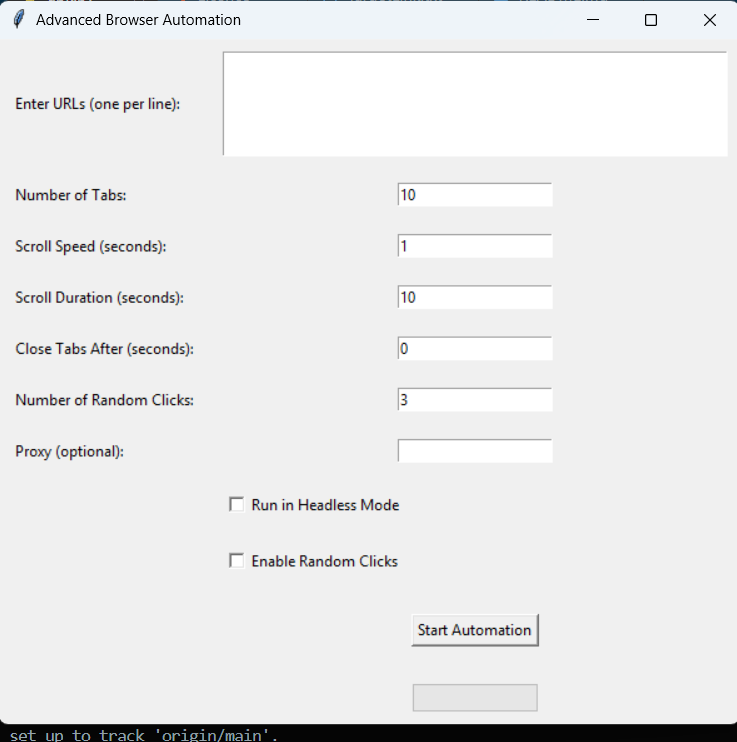
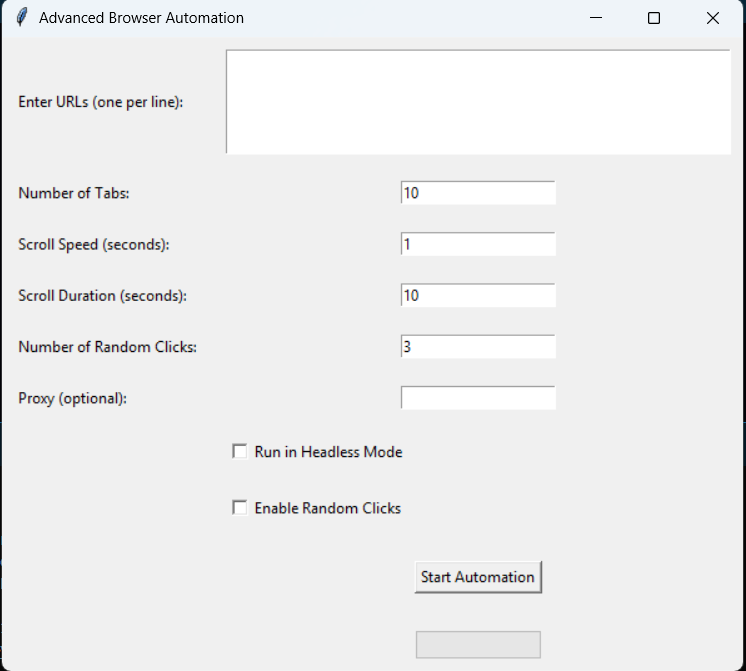

# Advanced Browser Automation

## Version 1.0
### Author: Shiboshree Roy
### Writer & Dev : Shiboshree Roy
### Date: 18-02-25 

## Description
This project is an advanced browser automation tool using Selenium and Tkinter with an iOS-like GUI design. It allows users to automate opening multiple browser tabs, perform scrolling actions, execute random clicks, and utilize proxy settings for anonymity.

## Features
- **Open Multiple Tabs:** Users can specify multiple URLs and open them in separate browser tabs.
- **Randomized Clicks:** Option to enable random clicks on links, buttons, and interactive elements.
- **Smooth Scrolling:** Automated scrolling within each tab with customizable speed and duration.
- **Headless Mode:** Users can run the browser in the background without UI interaction.
- **Proxy Support:** Allows users to enter a proxy server for anonymous browsing.
- **Delay Between Tabs:** Introduced a delay feature to better control tab opening intervals.
- **iOS-Like GUI:** The application features a modern, themed GUI using `ttkthemes` to provide a sleek user interface.
- **Logging & Error Handling:** All automation actions are logged, and errors are displayed in a user-friendly way.


## Project Images


---



## Installation
### Prerequisites
Ensure you have Python installed along with the following dependencies:
```sh
pip install selenium tk ttkthemes
```

### WebDriver Setup
You need to download the appropriate WebDriver for your browser (e.g., ChromeDriver for Google Chrome) and place it in your system's PATH.

## Usage
1. Run the script using:
   ```sh
   python apk.py
   ```
## Or
```sh
   python app.py
```
2. Enter URLs (one per line) in the text box.
3. Configure the desired automation settings (tab count, scroll speed, clicks, proxy, etc.).
4. Click "Start Automation" to begin.

## Future Enhancements
- Implement AI-based element interaction for more advanced automation.
- Add support for multiple browsers beyond Chrome.
- Include screenshot capturing and session recording.

## License
This project is licensed under the MIT License.

